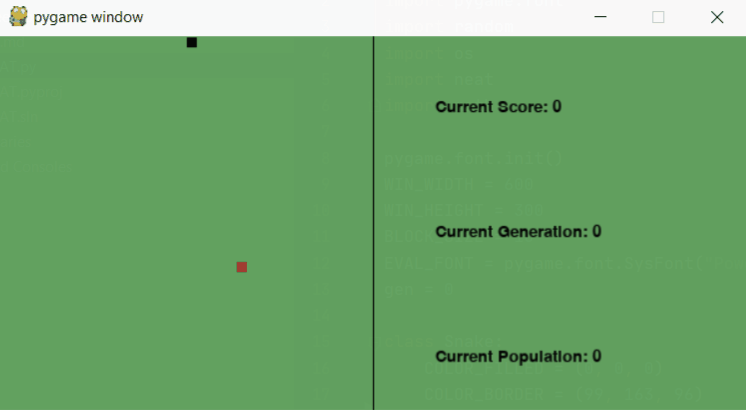

# SnakeNEAT

This is an attempt at implementing the [NEAT-Algorithm](https://en.wikipedia.org/wiki/Neuroevolution_of_augmenting_topologies "NEAT Wikipedia") on my self written Snake game.

Generally speaking we have generations of snakes. Each snake accumulates fitness while moving and eating and loses some if it crashes. Through fitness evaluation of the whole generation we can detect the snake (alongside its neural network) which performed best and can use it for future generations.
Over a couple generations we should see improvements in the snakes like better avoiding the walls or focusing on apples.


With my current implementation thats not the case and I still have to figure out which inputs are best to feed into the neural networks of the snakes in order for them to perform good.


## Demo



## Requirements

``` A working python installation ```

## How to run 

```
git clone https://github.com/CaptainKappa/SnakeNEAT.git
cd SnakeNEAT
pip install pygame, neat-python
py SnakeNEAT.py
```
